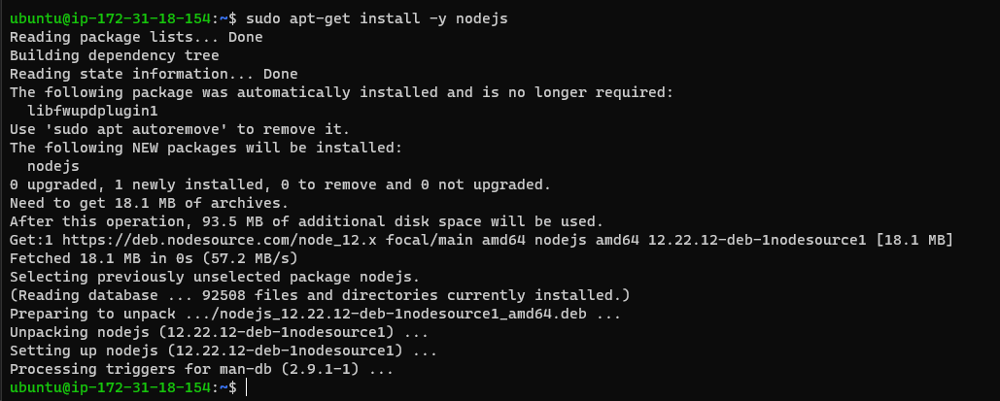
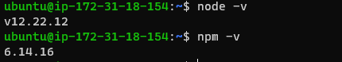
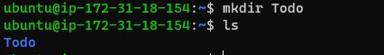
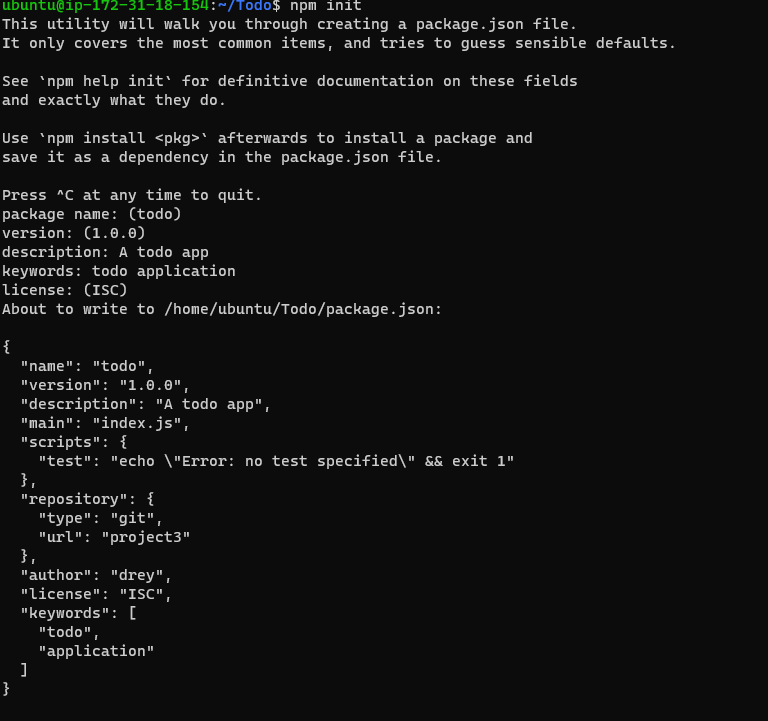
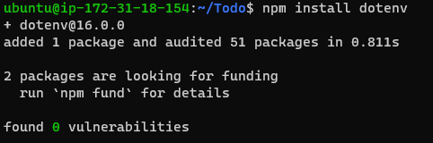
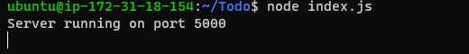
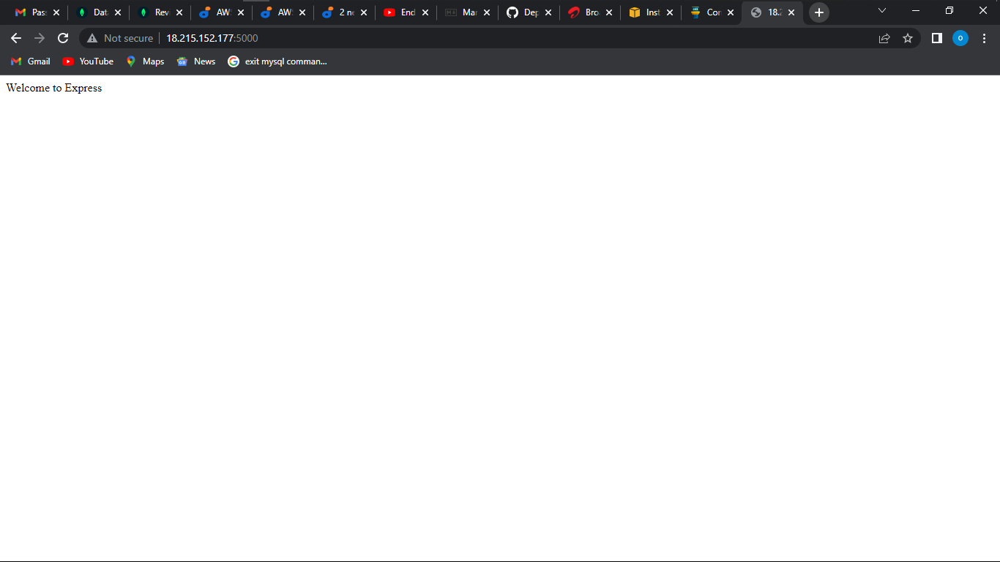
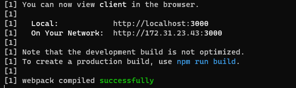
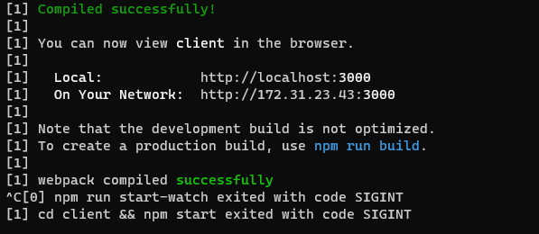

## DOCUMENTATION OF PROJECT 3

 Project 3 is about implementing a web solution based on MERN stack in AWS Cloud.

Firstly we start with updating our ubuntu with the code `sudo apt update`

Now we upgrde ubuntu with the code `sudo apt upgrade`

We start with getting the location of NODE.js software using the code `curl -sL https://deb.nodesource.com/setup_12.x | sudo -E bash -`

Now install NODE.js with the command `sudo apt-get install -y nodejs`

The command above installs both NODE.js and npm.

Now we verify the node installation with the commands below `node -v` and `npm -v`

 
 Now we move to the application code setup 

First we create a directory for our to-do list using the command `mkdir todo` verify with the `ls` 

Now we change the directory to the newly created one using the command `cd todo`. Next,we use the command `npm init` to initialise the project so that a new file named package.json will be created.

now we run the command `ls` to confirm the package.json is created

Next, we install ExpressJs and create the Routes directory.

now we install expressjs using the command `npm install express`. Now we create a file index.js using the command `touch index.js` , run `ls` to verify the file 

Now install the dotenv module use command `npm install dotenv`

Now we open the index.js file with the command `vim index.js` and input the code into the file 

`const express = require('express');
require('dotenv').config();

const app = express();

const port = process.env.PORT || 5000;

app.use((req, res, next) => {
res.header("Access-Control-Allow-Origin", "\*");
res.header("Access-Control-Allow-Headers", "Origin, X-Requested-With, Content-Type, Accept");
next();
});

app.use((req, res, next) => {
res.send('Welcome to Express');
});

app.listen(port, () => {
console.log(`Server running on port ${port}`)
});`

Save and close vim.

Now it is time to start our server to see if it works we use the command `node index.js`

Now we check our server on the browser 

Up and running

There are three actions that the To-Do application needs to be able to do. Each task will be associated with some particular endpoint.For each task, we need to create routes that will define various endpoints that the To-do app will depend on. So let us create folder routes usin the command `mkdir routes`, now we change directory to routes, now we create a file with the command `touch api.js` open the file and input the code in the file, save the file when done.

Create models directory. A model is at the heart of JavaScript based applications, and it is what makes it interactive

 install mongoose which is a Node.js package that makes working with mongodb easier. Using the command `npm install mongoose` we do this after changing directory back to todo 

 Now we create a new folder models then change directory to the new folder. Inside the models folder, create a file and name it todo.js we can do all this using one single command using the help of `&&`, now we run the command  `mkdir models && cd models && touch todo.js`

Now open the file created with `vim todo.js` and put the needed code into the file save when done. 

Now we need to update our routes from the file api.js. In routes directory open api.js and delete the code inside, paste the new code and save 

Now we need a database where we will store our data for this we use mlab 

Now create a MongoDB database and collection inside mLab after that we create a file in our todo directory and name it env.

Add connection string to connect database.update the index.js to reflect the use of .env 

After doing all this start the server using command `node index.js`

Now our backend code is ready, but the frontend UI is not ready yet.But during development, we will need a way to test our code using RESTfulL API in this project we will use POSTMAN API to test our server.

After this lets code our frontend, just a few more steps remaining 

Moving on to the next step. Create a user interface for the web browser to interact with the application 

Use the `create-react-app` command to scaffold our app. In the todo directory run command ` npx create-react-app client` this will create a new folder called client where we add the react code 

Before testting the react app need to install some dependencies. first install concurrently using the command `npm install concurrently --save-dev`, next we install nodemon using the command `npm install nodemon --save-dev`

Now make some changes to the package.json file , 

Now we configure proxy in package,json file open the file and input your key value pair

Now we run the command `npm run dev` the app should be running on port 3000

Now we creating React Components, change directory to clients then to src 

Inside src folder create another folder called componets, move into components directory in that directory  create three files Input.js, ListTodo.js and Todo.js. with the command `touch Input.js ListTodo.js Todo.js` 

open input.js file with the command `vi Input.js` insert the needed code and close the file. 

Change the directory back to clients. Now we need to install Axios, which is a Promise based HTTP, use command `npm install axios`.

Now we go back to components directory, After that open your ListTodo.js using the command `vi ListTodo.js` input the needed code and close the file.

Now open Todo.js file with command `vi Todo.js` input the code and close the file.

Now make little adjustment to the react code, move to the src folder run the command `vi app.js` insert the needed code into it exit the editor, open App.css file with command `vi App.css` in the same src diectory open the index.css file with command `vim index.css` past the needed code and exit the editor 

Now in the todo directory run the command `npm run dev` 

## WE HAVE SUCCESFULY CREATED A TODO APPLICATION USING MERN STACK APPLICATION
